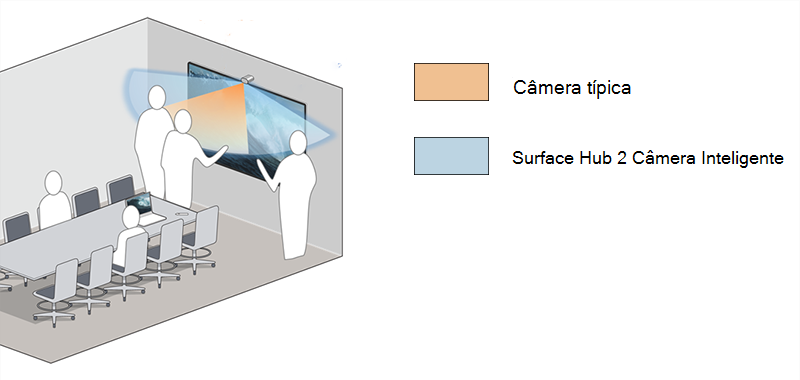

# Instalar e gerenciar Surface Hub 2 Smart Camera

Surface Hub 2 Smart Camera1 foi projetado para equipes híbridas e otimizado para participantes remotos. Com foco níidos no primeiro plano e no plano de fundo, os participantes remotos podem ver as pessoas interagirem com o conteúdo no Surface Hub enquanto também visualizam todos os outros na sala. Surface Hub 2 Smart Camera tem um amplo campo de visão maior que 136 graus, enquadramento automático, óptica de vidro de alta qualidade e um sensor de luz baixa.

*O modo de exibição de câmera ultra-wide inclui pessoas em quadro de comunicações em bordas extremas do Hub de 85"*

## Requisitos de sistema

Para Surface Hubs que executam o Team OS, o Surface Hub 2 Smart Camera requer as seguintes atualizações para [a atualização do Windows 10 Team 2020](surface-hub-2020-update-whats-new.md) (20H2) no Surface Hub 2:

- Windows 10 Team Atualização 2 de 2020 (KB5010415 ou uma atualização Windows posterior)
- Atualização de hardware do sistema — 21/1/2022 (ou uma atualização de hardware do sistema subsequente)

Para saber mais, confira o histórico [Surface Hub atualização](surface-hub-update-history.md).

> [!NOTE]
> Nenhuma atualização adicional é necessária para que os Surface Hubs migrados executem Windows 10 ou Windows 11 Pro/Enterprise.

## Instalar a câmera inteligente

1. Anexe a câmera à porta USB-C no meio da parte superior Surface Hub 2. O LED indicador acenderá brevemente quando a câmera estiver conectada e continuamente quando a câmera estiver em uso.

     

2. Para remover a câmera, puxe para cima e para frente. Um tether magnético impede que a câmera seja derrubada ou puxada para trás.

    

> [!TIP]
> A capa da câmera se ajusta magneticamente à frente para privacidade e a parte traseira para armazenamento quando não está em uso.

## Gerenciar configurações de enquadramento automático

O enquadramento automático amplia dinamicamente e mantém você centralizado no vídeo quando você se move. A maneira como você gerencia as configurações depende do sistema operacional instalado Surface Hub:

- [Windows 10 Team atualização de 2020 (20H2)](#windows-10-team-2020-update-20h2)
- [Windows 11 Desktop no Surface Hub](#windows-11-desktop-on-surface-hub)
- [Windows 10 Desktop no Surface Hub](#windows-10-desktop-on-surface-hub)

### Windows 10 Team atualização de 2020 (20H2)

Quando você instala o Surface Hub Smart Camera, o enquadramento automático é habilitado por padrão. Os administradores podem gerenciar o enquadramento automático Configurações por meio de um botão de alternância Ativado/Desativado que define o estado de enquadramento automático no início de cada Surface Hub sessão.

**Para ajustar o enquadramento automático:**

1. No seu Surface Hub 2S, entre como **Administrador**.

> [!NOTE]
> Se você não souber seu nome de usuário ou senha de administrador, precisará redefinir o dispositivo. Para obter mais informações, consulte [Redefinir e recuperar Surface Hub 2S](/surface-hub/surface-hub-2s-recover-reset).

2. Abra **Configurações** e vá para Surface Hub > **chamando & áudio.**
3. Em **Enquadramento automático**, ajuste o botão de alternância, conforme apropriado. 
4. Selecione **Encerrar sessão**; as configurações modificadas são aplicadas quando você inicia uma nova sessão. 

Se a alternância estiver definida como **Ativado, o** enquadramento automático sempre estará ativado por padrão quando os usuários iniciarem uma sessão no Surface Hub. Se o botão de alternância estiver definido como **Desativado, o** enquadramento automático sempre estará desativado por padrão ao iniciar uma sessão no Surface Hub.

#### Gerenciar configurações de câmera por meio de um provedor de MDM

Os administradores podem gerenciar o enquadramento automático por meio do CSP (provedor de serviços de configuração) do [Surface Hub Intune](/windows/client-management/mdm/surfacehub-csp) ou de um provedor de MDM (gerenciamento de dispositivo móvel) de terceiros.

|Configuração de política do CSP| Descrição|
|------------------|------------|
|DefaultAutomaticFraming|Se você ativar essa configuração de política, o enquadramento automático será habilitado. Se você desativar essa configuração de política, o enquadramento automático será desabilitado. Se você não definir essa configuração de política, o enquadramento automático será habilitado. |

Para saber mais, confira o seguinte:

- [Gerenciar configurações com um provedor MDM](/surface-hub/manage-settings-with-mdm-for-surface-hub#create-custom-configuration-profile)
- [CSP do SurfaceHub – gerenciamento Windows cliente](/windows/client-management/mdm/surfacehub-csp)

### Windows 11 Desktop no Surface Hub

Se você [migrou seu Surface Hub](surface-hub-2s-migrate-os.md) para executar Windows 11 Pro ou Windows 11 Enterprise, precisará ativar o enquadramento automático para a Surface Hub Smart Camera. Por padrão, o enquadramento automático é desativado.

Para ativar o enquadramento automático, acesse **Configurações > Bluetooth & dispositivos > Gerenciar Câmeras> Surface Hub 2 Câmera Inteligente.**

### Windows 10 Desktop no Surface Hub

O enquadramento automático sempre está habilitado e não pode ser desabilitado ou configurado de outra forma.

## Solicitar Surface Hub 2 Câmera Inteligente

Compre Surface Hub 2 Smart Camera de seu [revendedor autorizado do Microsoft Surface](https://www.microsoft.com/surface/business/where-to-buy-microsoft-surface?).

### Referências

1. Surface Hub 2 Smart Camera, vendida separadamente a partir de 16 de março de 2022, ajusta dinamicamente o feed de vídeo para participantes remotos. Surface Hub 2 Câmera Inteligente será incluída na caixa com Surface Hub 2S 85" a partir de maio de 2022.
