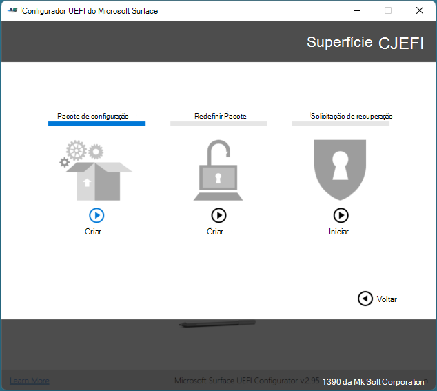
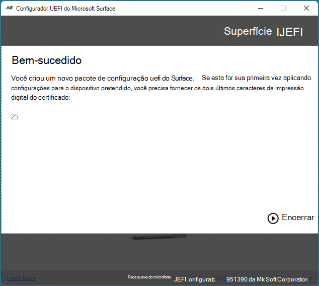

# Registrar e configurar dispositivos Surface com o SEMM

Com o Microsoft Surface Enterprise Modo de Gerenciamento (SEMM), você pode configurar com segurança as configurações do Surface UEFI em um dispositivo Surface e gerenciar essas configurações em dispositivos Surface em sua organização. Quando um dispositivo Surface é gerenciado pelo SEMM, esse dispositivo é considerado como inscrito *(às* vezes chamado de ativado). Este artigo mostra como criar um pacote de configuração UEFI do Surface que controlará não apenas as configurações do Surface UEFI, mas também registrará um dispositivo Surface no SEMM.

Para obter uma visão geral mais de alto nível do SEMM, consulte [Microsoft Surface Enterprise Modo de Gerenciamento.](https://technet.microsoft.com/itpro/surface/surface-enterprise-management-mode)

Como alternativa ao SEMM, os dispositivos Surface mais novos suportam o gerenciamento remoto de um subconjunto de configurações de firmware por meio Microsoft Intune. Para obter mais informações, consulte [Intune management of Surface UEFI settings](surface-manage-dfci-guide.md).

> [!NOTE]
> O SEMM é suportado no Surface Pro X somente por meio do Gerenciador UEFI. Para obter mais informações, consulte [Deploying, managing, and sering Surface Pro X](surface-pro-arm-app-management.md).

#### Baixar e instalar o Configurador UEFI do Microsoft Surface

A ferramenta usada para criar pacotes SEMM é o Microsoft Surface UEFI Configurator. Você pode baixar o Configurador UEFI do Microsoft Surface na página [Ferramentas do Surface para TI](https://www.microsoft.com/download/details.aspx?id=46703) no Centro de Download da Microsoft.
Execute o arquivo Do Microsoft Surface UEFI Configurator Windows Installer (.msi) para iniciar a instalação da ferramenta. Quando o instalador for concluído, encontre o Microsoft Surface UEFI Configurator na seção Todos os Aplicativos do seu menu Iniciar.

>[!NOTE]
>O Microsoft Surface UEFI Configurator só tem suporte em Windows 10.

## Criar um pacote de configuração uefi do Surface

O pacote de configuração uefi do Surface executa a função de aplicar uma nova configuração das configurações do Surface UEFI a um dispositivo Surface gerenciado com SEMM e a função de registrar dispositivos Surface no SEMM. A criação de um pacote de configuração exige que você tenha um certificado de assinatura a ser usado com o SEMM para proteger a configuração das configurações uefi em cada dispositivo Surface. Para obter mais informações sobre os requisitos para o certificado SEMM, consulte [Microsoft Surface Enterprise Modo de Gerenciamento.](https://technet.microsoft.com/itpro/surface/surface-enterprise-management-mode)

Para criar um pacote de configuração UEFI do Surface, siga estas etapas:

1. Abra o Configurador UEFI do Microsoft Surface a partir do menu Iniciar.
2. Clique em **Iniciar**.
3. Clique **em Pacote de**Configuração, conforme mostrado na Figura 1.

   

   *Figura 1. Selecione Pacote de Configuração para criar um pacote para registro e configuração semm*

4. Clique **em Proteção de Certificados** para adicionar seu arquivo de certificado exportado com chave privada (.pfx), conforme mostrado na Figura 2. Navegue até o local do arquivo de certificado, selecione o arquivo e clique em **OK**.

   

   *Figura 2. Adicione o certificado SEMM e a senha UEFI do Surface a um pacote de configuração uefi do Surface*

5. Quando você for solicitado a confirmar a senha do certificado, insira e confirme a senha do arquivo de certificado e clique em **OK**.
6. Clique **em Proteção de Senha** para adicionar uma senha ao Surface UEFI. Essa senha será necessária sempre que você for inicializado na UEFI. Se essa senha não for inserida, somente as informações do **computador**, **Sobre,** Enterprise **gerenciamento**e **páginas exit** serão exibidas. Esta etapa é opcional.
7. Quando você for solicitado, insira e confirme sua senha escolhida para o Surface UEFI e clique em **OK**. Se você quiser limpar uma senha UEFI existente do Surface, deixe o campo de senha em branco.
8. Se você não quiser que o pacote UEFI do **** Surface se aplique a um determinado dispositivo, na página Escolher qual tipo surface você deseja direcionar, clique no controle deslizante abaixo da imagem Surface Book ou Surface Pro 4 correspondente para que ele seja na **posição Off.** (Conforme mostrado na Figura 3.)
   > [!NOTE] 
   > Você deve selecionar um dispositivo como nenhum está selecionado por padrão.

   

   *Figura 3. Escolha os dispositivos para compatibilidade de pacote*

9. Clique em **Avançar**.
10. Se você quiser desativar um componente em dispositivos Surface gerenciados, na página Escolher quais componentes deseja ativar ou **desativar,** clique no controle deslizante ao lado **** de qualquer dispositivo ou grupo de dispositivos que você deseja desativar para que o controle deslizante está na posição Off. (Mostrado na Figura 4.) A configuração padrão para cada dispositivo é **On**. Clique no **botão Redefinir** se quiser retornar todos os controles deslizantes para a posição padrão.

    

    *Figura 4. Desabilitar ou habilitar componentes individuais do Surface*

11. Clique em **Avançar**.
12. Para habilitar ou desabilitar opções avançadas no Surface UEFI ou na exibição de páginas UEFI do Surface, na página **** Escolher as configurações avançadas para seus **dispositivos,** clique no controle deslizante ao lado da configuração desejada para configurar essa opção como Ativado ou Desligado **(mostrado** na Figura 5). Na seção **Front Page UEFI,** você pode usar **** os controles deslizantes para **Segurança,** Dispositivos e **Inicialização** para controlar quais páginas estão disponíveis para os usuários que inicializam no Surface UEFI. (Para obter mais informações sobre as configurações do Surface UEFI, consulte [Manage Surface UEFI settings](https://technet.microsoft.com/itpro/surface/manage-surface-uefi-settings).) Clique **em Criar** quando terminar de selecionar opções para gerar e salvar o pacote.

    

    *Figura 5. Controlar configurações avançadas da UEFI do Surface e páginas UEFI do Surface com SEMM*

13. Na caixa de diálogo Salvar **como,** especifique um nome para o pacote de configuração uefi do Surface, navegue até o local onde você gostaria de salvar o arquivo e clique em **Salvar**.
14. Quando o pacote é criado e salvo, a página **Bem-sucedida** é exibida.

>[!NOTE]
>Grave os caracteres de impressão digital do certificado exibidos nesta página, conforme mostrado na Figura 6. Você precisará desses caracteres para confirmar o registro de novos dispositivos Surface no SEMM. Clique **em Fim** para concluir a criação do pacote e feche o Configurador UEFI do Microsoft Surface.

*Figura 6. Os dois últimos caracteres da impressão digital do certificado são exibidos na página Bem-sucedido*

Agora que você criou o pacote de configuração uefi do Surface, você pode registrar ou configurar dispositivos Surface.

>[!NOTE]
>Quando um pacote de configuração UEFI do Surface é criado, um arquivo de log é criado na área de trabalho com detalhes das configurações e das opções do pacote de configuração.

## Registrar um dispositivo Surface no SEMM
Quando o pacote de configuração UEFI do Surface é executado, os arquivos de configuração UEFI e certificado SEMM são em estágios no armazenamento de firmware do dispositivo Surface. Quando o dispositivo Surface é reiniciado, o Surface UEFI processa esses arquivos e inicia o processo de aplicação da configuração uefi surface ou registro do dispositivo Surface no SEMM, conforme mostrado na Figura 7.

*Figura 7. O processo SEMM para configuração do Surface UEFI ou registro de um dispositivo Surface*

Antes de começar o processo para registrar um dispositivo Surface no SEMM, verifique se você tem os dois últimos caracteres da impressão digital do certificado em mãos. Você precisará desses caracteres para confirmar o registro do dispositivo (consulte a Figura 6).

Para registrar um dispositivo Surface no SEMM com um pacote de configuração uefi do Surface, siga estas etapas:

1. Execute o pacote de configuração uefi do Surface .msi arquivo no dispositivo Surface que você deseja registrar no SEMM. Isso provisionará o arquivo de configuração UEFI do Surface no firmware do dispositivo.
2. Selecione a **caixa de** seleção Aceito os termos na caixa de seleção Contrato de Licença para aceitar o Contrato de Licença de Usuário Final (EULA) e clique em **Instalar** para iniciar o processo de instalação.
3. Clique **em Concluir** para concluir a instalação do pacote de configuração uefi do Surface e reinicie o dispositivo Surface quando você for solicitado a fazer isso.
4. O Surface UEFI carregará o arquivo de configuração e determinará que o SEMM não está habilitado no dispositivo. A UEFI do Surface iniciará o processo de registro semm, da seguinte forma:
   * A UEFI do Surface verificará se o arquivo de configuração SEMM contém um certificado SEMM.
   * A UEFI do Surface solicitará que você insira os dois últimos caracteres da impressão digital do certificado para confirmar o registro do dispositivo Surface no SEMM, conforme mostrado na Figura 8.

      

      *Figura 8. O registro no SEMM requer os dois últimos caracteres da impressão digital do certificado*

   * A UEFI do Surface armazenará o certificado SEMM no firmware e aplicará as configurações especificadas no arquivo de configuração UEFI do Surface.
   
5. O dispositivo Surface agora está inscrito no SEMM e será inicializado para Windows.

Você pode verificar se um dispositivo Surface foi inscrito com êxito no SEMM procurando o Pacote de Configuração do **Microsoft Surface** em Programas e Recursos **(conforme** mostrado na Figura 9) ou nos eventos armazenados no log configurador uefi do **Microsoft Surface,** encontrado em **Logs** de aplicativos e serviços no Visualizador de Eventos (conforme mostrado na Figura 10).

*Figura 9. Verificar o registro de um dispositivo Surface no SEMM em Programas e Recursos*

*Figura 10. Verificar o registro de um dispositivo Surface no SEMM no Visualizador de Eventos*

Você também pode verificar se o dispositivo está inscrito no SEMM no Surface UEFI – enquanto o dispositivo está inscrito, a UEFI do Surface conterá **a** página de gerenciamento Enterprise (conforme mostrado na Figura 11).

*Figura 11. A página de gerenciamento Enterprise UEFI do Surface*

## Configurar configurações do Surface UEFI com SEMM

Depois que um dispositivo for inscrito no SEMM, você poderá executar pacotes de configuração UEFI do Surface assinados com o mesmo certificado SEMM para aplicar novas configurações do Surface UEFI. Essas configurações são aplicadas automaticamente na próxima vez que o dispositivo é inicializado, sem qualquer interação do usuário. Você pode usar soluções de implantação de aplicativos como Microsoft Endpoint Configuration Manager para implantar pacotes de configuração uefi do Surface em dispositivos Surface para alterar ou gerenciar as configurações no Surface UEFI.

Para obter mais informações sobre como implantar arquivos Windows Installer (.msi) com o Configuration Manager, consulte [Deploy and manage applications with Microsoft Endpoint Configuration Manager](https://technet.microsoft.com/library/mt627959).

Se você tiver protegido o Surface UEFI com uma senha, os usuários sem a senha que tentarem inicializar **** no Surface UEFI terão apenas as informações do **computador**, **Sobre**, Enterprise gerenciamento e páginas exit exibidas **para**eles.

Se você não tiver protegido a UEFI do Surface com uma senha ou um usuário inserir a senha corretamente, as configurações configuradas com o SEMM serão esmaecidas (indisponíveis) e o texto Algumas configurações serão gerenciadas pela sua organização serão exibidas na parte superior da página, conforme mostrado na Figura 12.

*Figura 12. Configurações gerenciado pelo SEMM será desabilitado no Surface UEFI*
