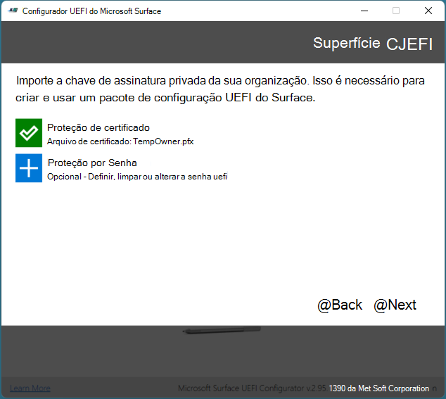

# Registrar e configurar dispositivos Surface com o SEMM

Com o Microsoft Surface Enterprise Management Mode (SEMM), você pode definir com segurança as configurações do UEFI do Surface em um dispositivo Surface e gerenciar essas configurações em dispositivos Surface em sua organização. Quando um dispositivo Surface é gerenciado pelo SEMM, esse dispositivo é considerado inscrito *(às* vezes chamado de ativado). Este artigo mostra como criar um pacote de configuração UEFI do Surface que não só controlará as configurações de UEFI do Surface, mas também registrará um dispositivo Surface no SEMM.

Para obter uma visão geral mais de alto nível do SEMM, consulte [o Modo de Gerenciamento empresarial do Microsoft Surface.](https://technet.microsoft.com/itpro/surface/surface-enterprise-management-mode)

Como alternativa ao SEMM, os dispositivos Surface mais novos suportam o gerenciamento remoto de um subconjunto de configurações de firmware por meio do Microsoft Intune. Para obter mais informações, consulte o [gerenciamento do Intune de configurações UEFI do Surface.](surface-manage-dfci-guide.md)

> [!NOTE]
> O SEMM é suportado no Surface Pro X somente por meio do Gerenciador UEFI. Para obter mais informações, consulte [Implantação, gerenciamento e manutenção do Surface Pro X.](surface-pro-arm-app-management.md)

#### Baixar e instalar o Configurador UEFI do Microsoft Surface

A ferramenta usada para criar pacotes SEMM é o Configurador UEFI do Microsoft Surface. Você pode baixar o Configurador UEFI do Microsoft Surface na página Ferramentas do [Surface para TI](https://www.microsoft.com/download/details.aspx?id=46703) no Centro de Download da Microsoft.
Execute o arquivo do Windows Installer (.msi) do Configurador UEFI do Microsoft Surface para iniciar a instalação da ferramenta. Quando o instalador for concluído, encontre o Configurador UEFI do Microsoft Surface na seção Todos os Aplicativos do menu Iniciar.

>[!NOTE]
>O Configurador UEFI do Microsoft Surface tem suporte apenas no Windows 10.

##  Criar um pacote de configuração UEFI do Surface

O pacote de configuração UEFI do Surface desempenha a função de aplicar uma nova configuração de configurações UEFI do Surface a um dispositivo Surface gerenciado com SEMM e a função de registrar dispositivos Surface no SEMM. A criação de um pacote de configuração exige que você tenha um certificado de assinatura a ser usado com SEMM para proteger a configuração das configurações de UEFI em cada dispositivo Surface. Para obter mais informações sobre os requisitos para o certificado SEMM, consulte [o Modo de Gerenciamento empresarial do Microsoft Surface.](https://technet.microsoft.com/itpro/surface/surface-enterprise-management-mode)

Para criar um pacote de configuração UEFI do Surface, siga estas etapas:

1. Abra o Configurador UEFI do Microsoft Surface no menu Iniciar.
2. Clique em **Iniciar**.
3. Clique **em Pacote de**Configuração, conforme mostrado na Figura 1.

   

   *Figura 1. Selecione o Pacote de Configuração para criar um pacote para inscrição e configuração do SEMM*

4. Clique **em Proteção de** Certificado para adicionar o arquivo de certificado exportado com a chave privada (.pfx), conforme mostrado na Figura 2. Navegue até o local do arquivo de certificado, selecione o arquivo e clique em **OK.**

   

   *Figura 2. Adicionar o certificado SEMM e a senha UEFI do Surface a um pacote de configuração UEFI do Surface*

5. Quando você for solicitado a confirmar a senha do certificado, insira e confirme a senha do arquivo de certificado e clique em **OK.**
6. Clique **em Proteção por** Senha para adicionar uma senha ao UEFI do Surface. Essa senha será necessária sempre que você inicializar para UEFI. Se essa senha não for inserida, somente as informações do **computador,** **Sobre**, **Gerenciamento empresarial**e páginas **de** saída serão exibidas. Esta etapa é opcional.
7. Quando você for solicitado, insira e confirme sua senha escolhida para UEFI do Surface e clique em **OK.** Se você quiser limpar uma senha UEFI existente do Surface, deixe o campo de senha em branco.
8. Se você não quiser que o pacote UEFI do Surface seja aplicado a um dispositivo específico, na página Escolher qual tipo de **Surface** você **** deseja direcionar, clique no controle deslizante abaixo da imagem do Surface Book ou do Surface Pro 4 correspondente para que ele se coloque na posição Desligado. (Conforme mostrado na Figura 3.)
   > [!NOTE] 
   > Você deve selecionar um dispositivo, pois nenhum está selecionado por padrão.

   

   *Figura 3. Escolher os dispositivos para compatibilidade de pacote*

9. Clique em **Avançar**.
10. Se você deseja desativar um componente em dispositivos **** Surface gerenciados, na página Escolher quais componentes deseja ativar ou desativar, clique no controle deslizante ao lado **** de qualquer dispositivo ou grupo de dispositivos que você deseja desativar para que o controle deslizante está na posição Desligado. (Mostrado na Figura 4.) A configuração padrão para cada dispositivo é **On**. Clique no **botão Redefinir** se quiser retornar todos os controles deslizantes para a posição padrão.

    

    *Figura 4. Desabilitar ou habilitar componentes individuais do Surface*

11. Clique em **Avançar**.
12. Para habilitar ou desabilitar opções avançadas em UEFI do Surface ou a exibição de páginas UEFI do Surface, na **** página Escolher as configurações avançadas para seus **dispositivos,** clique no controle deslizante ao lado da configuração desejada para definir essa opção como Ativado ou Desligado **(mostrado** na Figura 5). Na seção De página frontal **UEFI,** você pode **** usar **** os controles deslizantes de **segurança,** dispositivos e inicialização para controlar quais páginas estão disponíveis para os usuários que inicializam no UEFI do Surface. (Para obter mais informações sobre as configurações de UEFI do Surface, consulte [Gerenciar configurações de UEFI do Surface.)](https://technet.microsoft.com/itpro/surface/manage-surface-uefi-settings) Clique **em Criar** quando tiver terminado de selecionar opções para gerar e salvar o pacote.

    

    *Figura 5. Controlar configurações avançadas de UEFI do Surface e páginas UEFI do Surface com SEMM*

13. Na caixa de diálogo Salvar **como,** especifique um nome para o pacote de configuração UEFI do Surface, navegue até o local onde você gostaria de salvar o arquivo e clique em **Salvar.**
14. Quando o pacote é criado e salvo, a **página** Êxito é exibida.

>[!NOTE]
>Grave os caracteres de impressão digital do certificado exibidos nesta página, conforme mostrado na Figura 6. Você precisará desses caracteres para confirmar o registro de novos dispositivos Surface no SEMM. Clique **em Finalizar** para concluir a criação do pacote e feche o Configurador UEFI do Microsoft Surface.

*Figura 6. Os dois últimos caracteres da impressão digital do certificado são exibidos na página Bem-sucedida*

Agora que você criou seu pacote de configuração UEFI do Surface, pode registrar ou configurar dispositivos Surface.

>[!NOTE]
>Quando um pacote de configuração UEFI do Surface é criado, um arquivo de log é criado na área de trabalho com detalhes das configurações e opções do pacote de configuração.

##  Registrar um dispositivo Surface no SEMM
Quando o pacote de configuração UEFI do Surface é executado, o certificado SEMM e os arquivos de configuração UEFI do Surface são em estágios no armazenamento do firmware do dispositivo Surface. Quando o dispositivo Surface é reiniciado, a UEFI do Surface processa esses arquivos e inicia o processo de aplicar a configuração UEFI do Surface ou registrar o dispositivo Surface no SEMM, conforme mostrado na Figura 7.

*Figura 7. O processo SEMM para configuração de UEFI do Surface ou registro de um dispositivo Surface*

Antes de começar o processo para registrar um dispositivo Surface no SEMM, verifique se você tem os dois últimos caracteres da impressão digital do certificado em mãos. Você precisará desses caracteres para confirmar o registro do dispositivo (consulte a Figura 6).

Para registrar um dispositivo Surface no SEMM com um pacote de configuração UEFI do Surface, siga estas etapas:

1. Execute o arquivo .msi do pacote de configuração UEFI do Surface no dispositivo Surface que você deseja registrar no SEMM. Isso provisiona o arquivo de configuração UEFI do Surface no firmware do dispositivo.
2. Marque a **caixa de** seleção Aceito os termos na caixa de seleção Contrato de Licença para aceitar o Contrato de Licença de Usuário Final (EULA) e clique em **Instalar** para iniciar o processo de instalação.
3. Clique **em Concluir** para concluir a instalação do pacote de configuração UEFI do Surface e reinicie o dispositivo Surface quando for solicitado a fazê-lo.
4. O UEFI do Surface carregará o arquivo de configuração e determinará que o SEMM não está habilitado no dispositivo. Em seguida, a UEFI do Surface iniciará o processo de registro semm, da seguinte forma:
   * O UEFI do Surface verificará se o arquivo de configuração SEMM contém um certificado SEMM.
   * A UEFI do Surface solicitará que você insira os dois últimos caracteres da impressão digital do certificado para confirmar o registro do dispositivo Surface no SEMM, conforme mostrado na Figura 8.

      

      *Figura 8. O registro no SEMM requer os dois últimos caracteres da impressão digital do certificado*

   * O UEFI do Surface armazenará o certificado SEMM no firmware e aplicará as definições de configuração especificadas no arquivo de configuração UEFI do Surface.
   
5. O dispositivo Surface agora está inscrito no SEMM e será inicializado no Windows.

Você pode verificar se um dispositivo Surface foi inscrito com êxito no SEMM procurando o Pacote de Configuração do **Microsoft Surface** em Programas e Recursos **(conforme** mostrado na Figura 9) ou nos eventos armazenados no log do Configurador UEFI do **Microsoft Surface,** encontrados em **Logs** de Aplicativos e Serviços no Visualizador de Eventos (conforme mostrado na Figura 10).

*Figura 9. Verificar o registro de um dispositivo Surface no SEMM em Programas e Recursos*

*Figura 10. Verificar o registro de um dispositivo Surface no SEMM no Visualizador de Eventos*

Você também pode verificar se o dispositivo está inscrito no SEMM no UEFI do Surface **** – enquanto o dispositivo está inscrito, a UEFI do Surface conterá a página de gerenciamento Enterprise (conforme mostrado na Figura 11).

*Figura 11. A página de gerenciamento do Surface UEFI Enterprise*

##  Definir configurações de UEFI do Surface com SEMM

Depois que um dispositivo é inscrito no SEMM, você pode executar pacotes de configuração UEFI do Surface assinados com o mesmo certificado SEMM para aplicar novas configurações de UEFI do Surface. Essas configurações são aplicadas automaticamente na próxima vez que o dispositivo é inicializado, sem qualquer interação do usuário. Você pode usar soluções de implantação de aplicativo como o Microsoft Endpoint Configuration Manager para implantar pacotes de configuração UEFI surface em dispositivos Surface para alterar ou gerenciar as configurações no UEFI do Surface.

Para obter mais informações sobre como implantar arquivos do Windows Installer (.msi) com o Configuration Manager, consulte Implantar e gerenciar aplicativos com o [Microsoft Endpoint Configuration Manager.](https://technet.microsoft.com/library/mt627959)

Se você tiver protegido a UEFI do Surface com uma senha, os usuários sem a **** senha que **** tentarem inicializar a UEFI do Surface terão apenas as informações do computador **,** Sobre **,** Gerenciamento empresarial e páginas sair exibidas para eles.

Se você não tiver protegido o UEFI do Surface com uma senha ou um usuário inserir a senha corretamente, as configurações configuradas com SEMM serão esmaecidas (indisponíveis) e o texto Algumas configurações são gerenciadas pela sua organização serão exibidas na parte superior da página, conforme mostrado na Figura 12.

*Figura 12. As configurações gerenciadas pelo SEMM serão desabilitadas no UEFI do Surface*
