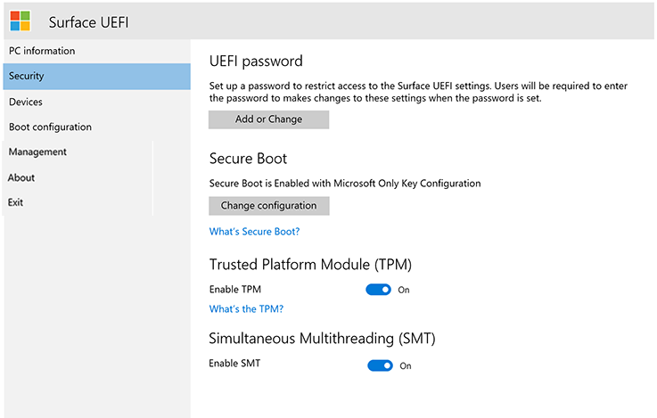

# Gerenciar configurações de UEFI do Surface

Todas as gerações atuais e futuras dos dispositivos Surface usam uma UEFI (Unified Extensible Firmware Interface) exclusiva criada pela Microsoft especificamente para esses dispositivos. As configurações de UEFI do Surface fornecem a capacidade de habilitar ou desabilitar dispositivos e componentes internos, proteger as configurações de UEFI contra alterações e ajustar as configurações de inicialização do dispositivo Surface. 

## Produtos com suporte

O gerenciamento UEFI é suportado no seguinte: 

- Surface Pro 4, Surface Pro (5ª geração), Surface Pro 6, Surface Pro 7, Surface Pro 7+, Surface Pro X
- Surface Laptop (1ª geração), Surface Laptop 2, Surface Laptop 3, Surface Laptop Go
- Surface Studio (1ª geração), Surface Studio 2
- Surface Book, Surface Book 2, Surface Book 3
- Surface Go, Surface Go 2

## Suporte para gerenciamento baseado em nuvem

Com perfis DFCI (Interface de Configuração de Firmware de Dispositivo) integrados ao Microsoft Intune (agora disponível na visualização pública), o gerenciamento de UEFI do Surface estende a pilha de gerenciamento moderna até o nível de hardware UEFI. O DFCI dá suporte ao provisionamento com zero toque, elimina senhas do BIOS, fornece controle das configurações de segurança, incluindo opções de inicialização e periféricos integrados, e dispõe a base para cenários de segurança avançados no futuro. DFCI is currently available for Surface Pro 7+, Surface Laptop Go, Surface Book 3, Surface Laptop 3, Surface Pro 7, and Surface Pro X.  Para obter mais informações, consulte o [gerenciamento do Intune de configurações UEFI do Surface.](surface-manage-dfci-guide.md)

## Abrir o menu UEFI do Surface

Para ajustar as configurações de UEFI durante a inicialização do sistema:

1. Desligue o Surface e aguarde cerca de 10 segundos para garantir que ele está desligado.
2. Pressione e segure o **botão aumentar o volume** e, ao mesmo tempo, pressione e solte o botão **Ligar/Desligar.**
3. Como o logotipo da Microsoft ou do Surface aparece na tela, continue a manter o **botão Aumentar** o volume até que a tela UEFI apareça.

## Página de informações do computador UEFI

A página de informações do computador inclui informações detalhadas sobre o dispositivo Surface: 

- **Modelo** – o modelo do dispositivo Surface será exibido aqui, como o Surface Book 2 ou o Surface Pro 7. A configuração exata de seu dispositivo não é exibida, (como processador, tamanho do disco ou tamanho da memória). 
- **UUID** – esse número de identificação universalmente exclusivo é específico de seu dispositivo e usado para identificar o dispositivo durante a implantação ou gerenciamento. 

- **Número de Série** – esse número é usado para identificar esse dispositivo Surface específico para cenários de marcação de ativos e suporte.
- **Marca do Ativo** – a marca do ativo é atribuída ao dispositivo Surface com a [Ferramenta de Marca do Ativo](https://docs.microsoft.com/surface/assettag). 

Você também encontrará informações detalhadas sobre o firmware de seu dispositivo Surface. Os dispositivos Surface têm vários componentes internos que executam diferentes versões do firmware. A versão do firmware de cada um dos seguintes dispositivos é exibida na página **Informações do computador** (como mostrado na Figura 1): 

- Sistema UEFI 

- Controlador SAM 

- Intel Management Engine 

- Controlador Incorporado do Sistema 

- Firmware de Toque 

*Figura 1. Informações do sistema e informações de versão do firmware*

Você pode encontrar informações atualizadas sobre a versão mais recente do firmware para o dispositivo Surface no [Histórico de Atualizações do Surface](https://www.microsoft.com/surface/support/install-update-activate/surface-update-history) para seu dispositivo. 

## Página segurança uefi 

*Figura 2. Definir configurações de segurança de UEFI do Surface*

A página Segurança permite definir uma senha para proteger as configurações de UEFI. Essa senha deve ser inserida quando você inicializa o dispositivo Surface para UEFI. A senha pode conter os seguintes caracteres (conforme mostrado na Figura 3): 

- Letras maiúsculas: A-Z 

- Letras minúsculas: a-z 

- Números: 1-0 

- Caracteres especiais: !@#$%^&*()?<>{} []-_=+|.,;:''" 

A senha deve ter pelo menos 6 caracteres e diferencia maiúsculas de minúsculas. 

*Figura 3. Adicionar uma senha para proteger as configurações de UEFI do Surface*

Na página Segurança também é possível alterar a configuração de Inicialização Segura no dispositivo Surface. A tecnologia de Inicialização Segura impede que o código de inicialização não autorizado inicialize no dispositivo Surface, o que protege contra infecções por malware do tipo bootkit e rootkit. Você pode desabilitar a Inicialização Segura para permitir que o dispositivo Surface inicialize sistemas operacionais de terceiros ou mídia inicializável. Você também pode configurar a Inicialização Segura para funcionar com certificados de terceiros, conforme mostrado na Figura 4. Leia mais sobre a [Inicialização Segura](https://msdn.microsoft.com/windows/hardware/commercialize/manufacture/desktop/secure-boot-overview) na Biblioteca do TechNet.

*Figura 4. Configurar a Inicialização Segura*

Dependendo do dispositivo, você também poderá ver se o TPM está habilitado ou desabilitado. Se você não vir a configuração Habilitar **TPM,**  abra tpm.msc no Windows para verificar o status, conforme mostrado na Figura 5. O TPM é usado para autenticar a criptografia dos dados de seu dispositivo com o BitLocker. Para saber mais, consulte a [visão geral do BitLocker.](https://docs.microsoft.com/windows/security/information-protection/bitlocker/bitlocker-overview) 

*Figura 5. Console do TPM*

## Menu UEFI: Dispositivos 

A página Dispositivos permite habilitar ou desabilitar dispositivos e componentes específicos, incluindo:

- Encaixe e portas USB 

- Slot de cartão MicroSD ou SD 

- Câmera Traseira 

- Câmera Frontal 

- Câmera de infravermelho (IV) 

- Wi-Fi e Bluetooth 

- Áudio integrado (alto-falantes e microfone) 

Cada dispositivo é listado com um botão **** de controle deslizante que você pode mover para a posição Ativado (habilitado) ou Desativado (desabilitado), conforme mostrado na Figura 6. **** 

*Figura 6. Habilitar e desabilitar dispositivos específicos*

## Menu UEFI: Configuração de inicialização 

A página Configuração de Inicialização permite alterar a ordem dos dispositivos de inicialização, bem como habilitar ou desabilitar a inicialização dos seguintes dispositivos: 

- Gerenciador de Inicialização do Windows 

- Armazenamento USB 

- Rede PXE 

- Armazenamento interno 

Você pode inicializar a partir de um dispositivo específico imediatamente ou pode passar o dedo para a esquerda na entrada desse dispositivo na lista usando a tela touch. Você também pode inicializar imediatamente em um dispositivo USB ou um adaptador de Ethernet USB quando o dispositivo Surface está desligado, pressionando o botão de **Diminuir o Volume** e o botão **Ligar/Desligar** simultaneamente. 

Para que a ordem de inicialização especificada **** entre em vigor, você deve definir a opção Habilitar Sequência de Inicialização Alternativa como **Ativada,** conforme mostrado na Figura 7. 

*Figura 7. Configurar a ordem de inicialização para o dispositivo Surface* 

Você também pode ativar e desativar o suporte a IPv6 para PXE com a opção **Habilitar IPv6 para Inicialização de Rede PXE**, por exemplo, ao executar uma implantação do Windows usando o PXE, onde o servidor PXE é configurado somente para IPv4.  

## Menu UEFI: Gerenciamento
A página gerenciamento permite que você gerencie o uso do Gerenciamento DE UEFI Zero Touch e outros recursos em dispositivos qualificados, incluindo Surface Pro 7, Surface Pro X e Surface Laptop 3.  

 *Figura 8. Gerenciar o acesso ao Gerenciamento DE UEFI Zero Touch e outros recursos* 

O Gerenciamento DE UEFI Zero Touch permite gerenciar remotamente as configurações de UEFI usando um perfil de dispositivo no Intune chamado Interface de Configuração do Firmware de Dispositivo (DFCI). Se você não definir essa configuração, a capacidade de gerenciar dispositivos qualificados com DFCI será definida como **Pronto.** Para impedir DFCI, selecione **Opt-Out**. 

> [!NOTE]
> A página de configurações de Gerenciamento UEFI e o uso de DFCI estão disponíveis atualmente para o Surface Pro 7+, Surface Laptop Go, Surface Book 3, Surface Laptop 3, Surface Pro 7 e Surface Pro X. Para saber mais, consulte [Gerenciamento do Intune de configurações UEFI do Surface.](surface-manage-dfci-guide.md)

## Menu UEFI: Sair 

Use o **botão Reiniciar Agora** na página **Sair** para sair das configurações UEFI, conforme mostrado na Figura 9. 

*Figura 9. Clique em Reiniciar Agora para sair do UEFI do Surface e reiniciar o dispositivo*

## Telas de inicialização UEFI Surface

Quando você atualiza o firmware do dispositivo Surface, usando o Windows Update ou instalação manual, as atualizações não são aplicadas imediatamente para o dispositivo, só durante o próximo ciclo de reinicialização. Você pode saber mais sobre o processo de atualização do firmware do Surface no [Gerenciar atualizações de driver e firmware do Surface](https://docs.microsoft.com/surface/manage-surface-pro-3-firmware-updates). O progresso da atualização do firmware é exibido em uma tela com barras de progresso de cores diferentes para indicar o firmware para cada componente. A barra de progresso de cada componente é mostrada nas Figuras 9 a 18.

*Figura 10. A atualização do firmware UEFI do Surface exibe uma barra de progresso azul*

*Figura 11. A atualização de firmware de controlador incorporado no sistema exibe uma barra de progresso verde*

*Figura 12. A atualização do firmware de SAM Controller exibe uma barra de progresso laranja*

*Figura 13. A atualização de firmware da Intel Management Engine exibe uma barra de progresso vermelho*

*Figura 14. A atualização de firmware do Surface toque exibe uma barra de progresso cinza*

*Figura 15. A atualização de firmware do Surface FIRMWARE DO SURFACE exibe uma barra de progresso verde claro*

*Figure 16 The Surface ISH firmware update displays a light pink progress bar*

*Figura 17. A atualização do firmware do Surface Trackpad exibe uma barra de progresso rosa*

*Figura 18. A atualização do firmware do Surface TCON exibe uma barra de progresso cinza claro*

*Figura 19. A atualização do firmware do TPM do Surface exibe uma barra de progresso roxo*

>[!NOTE]
>Uma mensagem de aviso adicional que indica que a Inicialização Segura está desabilitada é exibida, conforme mostrado na Figura 19.

*Figura 20. Tela de inicialização do Surface que indica que a inicialização segura foi desativada nas configurações de UEFI do Surface*

## Tópicos relacionados

- [Gerenciamento pelo Intune das configurações de UEFI do Surface](surface-manage-dfci-guide.md)

-  [Modo de gerenciamento empresarial do Surface](surface-enterprise-management-mode.md)
