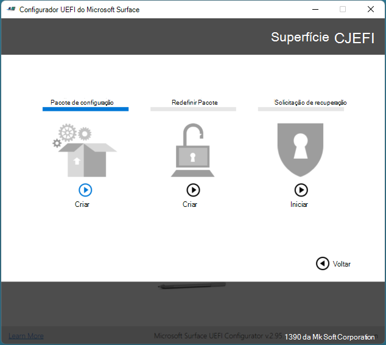

# Modo de gerenciamento do Microsoft Surface Enterprise

O modo de gerenciamento do Microsoft Surface Enterprise (SEMM) é um recurso de dispositivos Surface com UEFI de superfície que permite proteger e gerenciar as configurações de firmware dentro da sua organização. Com o SEMM, os profissionais de ti podem preparar as configurações de UEFI e instalá-las em um dispositivo de superfície. Além da capacidade de configurar as configurações de UEFI, o SEMM também usa um certificado para proteger a configuração contra violação ou remoção não autorizada. SEMM é um requisito para poder migrar um Surface Hub 2S para o Windows 10 pro e Enterprise.

>[!NOTE]
>O SEMM está disponível apenas em dispositivos com firmware da Surface UEFI. Isso compreende a maioria dos outros dispositivos de superfície, incluindo os SKUs do Surface Pro 7, Surface Pro X, Surface Hub 2S e Surface laptop 3 comercial com um processador Intel. Não há suporte para SEMM no 15 "Surface laptop 3 SKU com processador AMD (disponível apenas como SKU de varejo). 

Quando os dispositivos Surface são configurados pelo SEMM e protegidos com o certificado SEMM, eles são considerados *registrados* no Semm. Quando o certificado SEMM é removido e o controle das configurações de UEFI é retornado ao usuário do dispositivo, o dispositivo de superfície é considerado não *cadastrado* no Semm.

Há duas opções administrativas que você pode usar para gerenciar o SEMM e registrar dispositivos de superfície – uma ferramenta autônoma ou integração com o Gerenciador de configuração do Microsoft Endpoint. A ferramenta autônoma SEMM, chamada Microsoft Surface UEFI configural, é descrita neste artigo. Para obter mais informações sobre como gerenciar o SEMM com o Microsoft Endpoint Configuration Manager, consulte [usar o Gerenciador de configuração do Microsoft Endpoint para gerenciar dispositivos com o Semm](https://technet.microsoft.com/itpro/surface/use-system-center-configuration-manager-to-manage-devices-with-semm).


## Configurador UEFI da Microsoft Surface

O espaço de trabalho principal do SEMM é o Microsoft Surface UEFI Configuration, conforme mostrado na Figura 1. O configurador UEFI da Microsoft Surface é uma ferramenta usada para criar pacotes do Windows Installer (. msi) ou imagens WinPE usadas para registrar, configurar e cancelar o registro de SEMM em um dispositivo Surface. Esses pacotes contêm um arquivo de configuração onde as configurações para UEFI são especificadas. Os pacotes SEMM também contêm um certificado, que é instalado e armazenado no firmware e usado para verificar a assinatura de arquivos de configuração antes que as configurações de UEFI sejam aplicadas.

>[!NOTE]
>Agora você pode usar o configurador UEFI da Surface e o SEMM para gerenciar portas no Surface Dock 2. Para saber mais, veja [proteger portas do Dock Surface 2 com Semm](secure-surface-dock-ports-semm.md).



*Figura 1. Configurador UEFI da Microsoft Surface*


Você pode usar a ferramenta Microsoft Surface UEFI Configuration em três modos:

* [Pacote de configuração do Surface UEFI](#configuration-package). Use esse modo para criar um pacote de configuração do Surface UEFI para registrar um dispositivo de superfície no SEMM e definir as configurações de UEFI em dispositivos registrados.
* [Pacote de redefinição de UEFI de superfície](#reset-package). Use esse modo para cancelar o registro de um dispositivo de superfície do SEMM.
* [Solicitação de recuperação de UEFI de superfície](#recovery-request). Use esse modo para responder a uma solicitação de recuperação para cancelar o registro de um dispositivo de superfície do SEMM em que uma operação de redefinição de pacote não é bem-sucedida.


#### Baixar o Microsoft Surface UEFI Configuration

Você pode baixar o configurador UEFI da Microsoft Surface na página [Surface Tools para it](https://www.microsoft.com/download/details.aspx?id=46703) no centro de download da Microsoft.

### Pacote de configuração

Os pacotes de configuração UEFI da superfície são o mecanismo principal para implementar e gerenciar o SEMM em dispositivos Surface. Esses pacotes contêm um arquivo de configuração das configurações de UEFI especificado durante a criação do pacote no Microsoft Surface UEFI Configuration e em um arquivo de certificado, como mostrado na Figura 2. Quando um pacote de configuração é executado pela primeira vez em um dispositivo de superfície que ainda não está registrado no SEMM, ele provisiona o arquivo de certificado no firmware do dispositivo e registra o dispositivo no SEMM. Ao registrar um dispositivo no SEMM, você será solicitado a confirmar a operação fornecendo os dois últimos dígitos da impressão digital do certificado SEMM para que o arquivo de certificado seja armazenado e o registro possa ser concluído. Esta confirmação exige que um usuário esteja fisicamente presente no dispositivo no momento da inscrição para executar a confirmação.


*Figura 2. Proteger um pacote de configuração do SEMM com um certificado*

Para obter mais informações sobre os requisitos do certificado do SEMM, consulte a seção [requisitos de certificado do modo de gerenciamento da empresa Surface](#surface-enterprise-management-mode-certificate-requirements) deste artigo.

>[!NOTE]
>Você também pode especificar uma senha UEFI com SEMM que é necessário para exibir a **segurança**, **dispositivos**, **configuração de inicialização**ou páginas de **gerenciamento empresarial** do Surface UEFI.

Depois que um dispositivo é registrado no SEMM, o arquivo de configuração é lido e as configurações especificadas no arquivo são aplicadas a UEFI. Quando você executa um pacote de configuração em um dispositivo que já está registrado no SEMM, a assinatura do arquivo de configuração é verificada em relação ao certificado armazenado no firmware do dispositivo. Se a assinatura não corresponder, nenhuma alteração será aplicada ao dispositivo.

### Habilitar ou desabilitar dispositivos no Surface UEFI com o SEMM

A lista a seguir mostra todos os dispositivos disponíveis que você pode gerenciar no SEMM:

* Encaixando a porta USB
* Áudio integrado
* DGPU
* Capa Teclado
* Placa micro SD
* Câmera Frontal
* Câmera Traseira
* Câmera de infravermelho para Windows Hello
* Somente Bluetooth
* Wi-Fi e Bluetooth
*              LTE           

 >[!NOTE]
>Os dispositivos internos que aparecem na página de dispositivos UEFI podem variar de acordo com o seu dispositivo ou ambiente corporativo. Por exemplo, a página de dispositivos UEFI não é suportada no Surface Pro X; O LTE é exibido apenas em dispositivos equipados com o LTE. 
### Definir configurações avançadas com o SEMM
**Tabela 1. Configurações avançadas**

| Configuração                            | Descrição                                                                                                                                                                                        |
| ---------------------------------- | -------------------------------------------------------------------------------------------------------------------------------------------------------------------------------------------------- |
| Inicialização de IPv6 para PXE                  | Permite que você gerencie o suporte do IPv6 para inicialização PXE. Se você não definir essa configuração, o suporte do IPv6 para inicialização PXE será desabilitado.                                                                               |
| Inicialização alternativa                     | Permite que você gerencie o uso de uma ordem de inicialização alternativa para inicializar diretamente em um dispositivo USB ou Ethernet pressionando o botão de volume e o botão de energia durante a inicialização. Se você não definir essa configuração, a inicialização alternativa será habilitada. |
| Bloqueio da ordem de inicialização                    | Permite que você bloqueie a ordem de inicialização para impedir alterações. Se você não definir essa configuração, o bloqueio da ordem de inicialização será desabilitado.                                                                                                        |
| Inicialização USB                           | Permite que você gerencie a inicialização em dispositivos USB. Se você não definir essa configuração, a inicialização USB será habilitada.                                                                                                                 |
| Pilha de rede                      | Permite que você gerencie as configurações de inicialização da pilha de rede. Se você não definir essa configuração, a capacidade de gerenciar as configurações de inicialização da pilha de rede estará desabilitada.                                                                                                           |
| Ligar automaticamente                      | Permite que você gerencie as configurações de inicialização automática de energia. Se você não definir essa configuração, o recurso de ativação automática ativada estará habilitado.                                                                                                        |
| Vários encadeamentos simultâneos (SMT) | Permite que você gerencie o multi-threading simultâneo (SMT) para habilitar ou desabilitar o hyperthreading. Se você não definir essa configuração, o SMT será habilitado.                                                  |
|Habilitar limite de bateria| Permite gerenciar a funcionalidade de limite de bateria. Se você não definir essa configuração, o limite da bateria será habilitado |
| Segurança                           | Exibe a página de **segurança** da Surface UEFI. Se você não definir essa configuração, a página segurança será exibida.                                                                                                                 |
| Devices                            | Exibe a página de **dispositivos** UEFI de superfície. Se você não definir essa configuração, a página dispositivos será exibida.                                                                                                                     |
| Iniciar                               | Exibe a página de **inicialização** UEFI de superfície. Se você não definir essa configuração, a página de inicialização será exibida.                                                                                                                                                            |
| DateTime                           | Exibe a página de **data/hora** UEFI da superfície. Se você não definir essa configuração, a página DateTime será exibida.                                                                                                                |
| EnableOSMigration                          | Permite que você migre o Surface Hub 2 da equipe do Windows 10 para o Windows 10 pro ou Enterprise. Se você não definir essa configuração, OS dispositivos Surface Hub 2 só poderão executar o sistema operacional de equipe do Windows 10.   Observação: a inicialização dupla entre a equipe do Windows 10 e o Windows 10 Pro/Enterprise não está disponível no Surface Hub 2.                                                                                                           |


>[!NOTE]
>Quando você cria um pacote de configuração SEMM, dois caracteres são exibidos na página **bem-sucedida** , conforme mostrado na Figura 3.


*Figura 3. Exibir os dois últimos caracteres da impressão digital do certificado na página bem-sucedida*

Esses caracteres são os dois últimos caracteres da impressão digital do certificado e devem ser anotados ou gravados. Os caracteres são necessários para confirmar o registro no SEMM em um dispositivo Surface, conforme mostrado na Figura 4.


*Figura 4. Confirmação de registro no SEMM com a impressão digital de certificado SEMM*

>[!NOTE]
>Os administradores com acesso ao arquivo de certificado (. pfx) podem ler a impressão digital a qualquer momento abrindo o arquivo. pfx em CertMgr. Para exibir a impressão digital com o CertMgr, siga este processo:
>1. Clique com o botão direito do mouse no arquivo. pfx e, em seguida, clique em **abrir**.
>2. Expanda a pasta no painel de navegação.
>3. Clique em **Certificados**.
>4. Clique com o botão direito do mouse no certificado no painel principal e, em seguida, clique em **abrir**.
>5. Clique na guia **detalhes** .
>6. **Todas as** **Propriedades ou somente** devem ser selecionadas no menu suspenso **Mostrar** .
>7. Selecione a **impressão digital**do campo.

Para registrar um dispositivo de superfície no SEMM ou aplicar a configuração de UEFI a partir de um pacote de configuração, tudo o que você precisa fazer é executar o arquivo. msi com privilégios administrativos no dispositivo de superfície pretendido. Você pode usar as tecnologias de implantação de aplicativos ou implantação de sistema operacional, como o [Microsoft Endpoint Configuration Manager](https://technet.microsoft.com/library/mt346023) ou o [Kit de ferramentas de implantação da Microsoft](https://technet.microsoft.com/windows/dn475741). Ao registrar um dispositivo no SEMM, você deve estar fisicamente presente para confirmar a inscrição no dispositivo. A interação do usuário não é necessária quando você aplica uma configuração aos dispositivos que já estão registrados no SEMM.

Para obter uma orientação passo a passo sobre como registrar um dispositivo de superfície no SEMM ou aplicar uma configuração de Surface UEFI com SEMM, consulte [registrar e configurar dispositivos de superfície com Semm](https://technet.microsoft.com/itpro/surface/enroll-and-configure-surface-devices-with-semm).

### Redefinir pacote

Um pacote de redefinição de Semm de superfície é usado para executar apenas uma tarefa — para cancelar o registro de um dispositivo de superfície de. O pacote Reset contém instruções assinadas para remover o certificado SEMM do firmware do dispositivo e para redefinir as configurações de UEFI para o padrão de fábrica. Assim como um pacote de configuração do Surface UEFI, um pacote de redefinição deve ser assinado com o mesmo certificado SEMM provisionado no dispositivo Surface. Quando você cria um pacote de redefinição do SEMM, é necessário fornecer o número de série do dispositivo de superfície que pretende redefinir. Os pacotes de redefinição do SEMM não são universais e são específicos de um dispositivo.

### Solicitação de recuperação

Em alguns cenários, talvez seja impossível usar um pacote de redefinição de UEFI de superfície. (Por exemplo, se o Windows ficar inutilizável no dispositivo Surface.) Nesses cenários, você pode cancelar o registro do dispositivo Surface da SEMM por meio da página de **Gerenciamento da empresa** do Surface UEFI (mostrada na Figura 5) com uma operação de solicitação de recuperação.


*Figura 5. Iniciar uma solicitação de recuperação do SEMM na página de gerenciamento da empresa*

Ao usar o processo na página de **Gerenciamento da empresa** para redefinir o Semm em um dispositivo Surface, você recebe uma solicitação de redefinição. Esta solicitação de redefinição pode ser salva como um arquivo em uma unidade USB, copiada como texto ou lida como um código QR com um dispositivo móvel para ser facilmente enviado ou enviado para mensagem. Use a opção solicitar solicitação de redefinição do Microsoft Surface UEFI para carregar um arquivo de solicitação de redefinição ou digite o texto de solicitação de redefinição ou o código QR. O Microsoft Surface UEFI configuradora vai gerar um código de verificação que pode ser inserido no dispositivo Surface. Se você inserir o código no dispositivo Surface e clicar em **reiniciar**, o dispositivo será cancelado no Semm. 

>[!NOTE]
>Uma solicitação de redefinição expira duas horas após sua criação.

Para obter instruções passo a passo sobre como cancelar o registro de dispositivos de superfície do SEMM, consulte [cancelar a inscrição de dispositivos de superfície do Semm](https://technet.microsoft.com/itpro/surface/unenroll-surface-devices-from-semm).

## Requisitos de certificado do modo de gerenciamento empresarial Surface
Usar SEMM com o Microsoft Surface UEFI Configuration requer um certificado para verificar a assinatura de arquivos de configuração antes que as configurações de UEFI possam ser aplicadas. Esse certificado garante que depois que um dispositivo é registrado no SEMM, somente pacotes criados com o certificado aprovado podem ser usados para modificar as configurações de UEFI.

>[!NOTE]
>O certificado SEMM é necessário para realizar qualquer modificação nas configurações de SEMM ou de Surface UEFI em dispositivos de superfície registrados. Se o certificado SEMM estiver corrompido ou perdido, SEMM não poderá ser removido ou redefinido. Gerencie seu certificado SEMM de acordo com uma solução apropriada para backup e recuperação.

Os pacotes criados com a ferramenta Microsoft Surface UEFI configurador são assinados com um certificado. Esse certificado garante que depois que um dispositivo é registrado no SEMM, somente pacotes criados com o certificado aprovado podem ser usados para modificar as configurações de UEFI. 
### Configurações de certificado recomendadas
As configurações a seguir são recomendadas para o certificado SEMM:

* **Algoritmo de chave** – RSA 
* **Comprimento da chave** – 2048
* **Algoritmo de hash** – SHA-256
* **Tipo** – autenticação do servidor SSL
* **Uso da chave** – assinatura digital, criptografia de chaves
* **Provedor** – Microsoft Enhanced RSA e provedor criptográfico AES
* **Data de vencimento** – 15 meses a partir da criação do certificado
* **Política de exportação de chaves** – exportável

Também é recomendável que o certificado SEMM seja autenticado em uma arquitetura de infraestrutura de chave pública (PKI) de duas camadas na qual a autoridade de certificação intermediária (CA) seja dedicada ao SEMM, habilitando a revogação de certificado. Para obter mais informações sobre uma configuração de PKI de dois níveis, consulte [Guia de laboratório de teste: Implantando uma hierarquia de PKI de duas camadas do AD CS](https://technet.microsoft.com/library/hh831348).

### Certificado auto-assinado 
Você pode usar o exemplo de script do PowerShell a seguir para criar um certificado auto-assinado para usar em cenários de prova de conceito.
Para usar esse script, copie o seguinte texto para o bloco de notas e salve o arquivo como um script do PowerShell (. ps1). Observação: esse script cria um certificado com uma senha `12345678` . O certificado gerado por esse script não é recomendado para ambientes de produção.
  
   ```
if (-not (Test-Path "Demo Certificate"))  { New-Item -ItemType Directory -Force -Path "Demo Certificate" }
if (Test-Path "Demo Certificate\TempOwner.pfx") { Remove-Item "Demo Certificate\TempOwner.pfx" }

# Generate the Ownership private signing key with password 12345678
$pw = ConvertTo-SecureString "12345678" -AsPlainText -Force

$TestUefiV2 = New-SelfSignedCertificate `
  -Subject "CN=Surface Demo Kit, O=Contoso Corporation, C=US" `
  -Type SSLServerAuthentication `
  -HashAlgorithm sha256 `
  -KeyAlgorithm RSA `
  -KeyLength 2048 `
  -KeyUsage KeyEncipherment `
  -KeyUsageProperty All `
  -Provider "Microsoft Enhanced RSA and AES Cryptographic Provider" `
  -NotAfter (Get-Date).AddYears(25) `
  -TextExtension @("2.5.29.37={text}1.2.840.113549.1.1.1") `
  -KeyExportPolicy Exportable

$TestUefiV2 | Export-PfxCertificate -Password $pw -FilePath "Demo Certificate\TempOwner.pfx"
   ```

>[!IMPORTANT]
>Para uso com SEMM e Microsoft Surface UEFI Configuration, o certificado deve ser exportado com a chave privada e com proteção por senha. O configurador UEFI da Microsoft Surface solicitará que você selecione o arquivo de certificado SEMM (. pfx) e a senha do certificado quando for necessário.

1.  Crie uma pasta na unidade C: onde você salvará o script; por exemplo, C:\SEMM.
2.  Copie o script de exemplo no bloco de notas ou no editor de texto equivalente e salve o arquivo como um script do PowerShell (. ps1).
3.  Conecte-se ao seu computador com as credenciais de administrador e abra uma sessão do PowerShell com privilégios elevados.
4.  Verifique se as permissões estão definidas para permitir que os scripts sejam executados. Por padrão, os scripts são bloqueados a partir da execução, a menos que você modifique a política de execução. Para saber mais, consulte sobre as políticas de execução.
5.  No prompt de comando, digite o caminho completo do script e pressione Enter. O script cria um certificado de demonstração chamado TempOwner. pfx.

Você também pode criar seu próprio certificado auto-assinado usando o PowerShell. Para obter mais informações, consulte a seguinte documentação do PowerShell: [New-SelfSignedCertificate] (https://docs.microsoft.com/powershell/module/pkiclient/new-selfsignedcertificate)


>[!NOTE]
>Para as organizações que usam uma raiz offline na infraestrutura de PKI, o configurador UEFI da Microsoft Surface deve ser executado em um ambiente conectado à CA raiz para autenticar o certificado SEMM. Os pacotes gerados pelo Microsoft Surface UEFI configurador podem ser transferidos como arquivos e, portanto, podem ser transferidos fora do ambiente de rede offline com armazenamento removível, como um joystick USB.

### Perguntas frequentes sobre o gerenciamento de certificados

O comprimento *mínimo* recomendado é de 15 meses. Você pode usar um certificado que expire em menos de 15 meses ou usar um certificado que expira em mais de 15 meses.

>[!NOTE] 
>Quando um certificado expira, ele não é renovado automaticamente. 


**Um certificado expirado afeta a funcionalidade dos dispositivos SEMM?**<br><br>
Não, um certificado afeta apenas as tarefas de gerenciamento de administração de ti no SEMM e não afeta a funcionalidade do dispositivo quando ele expira.


**O pacote SEMM e o certificado precisam ser atualizados em todos os computadores que o possuem?**

Se você quiser que o SEMM Reset ou recuperação funcione, o certificado precisa ser válido e não expirar. 

**É possível criar pacotes de restauração em massa para cada superfície encomendado? Pode ser criado um redefina todas as máquinas em nosso ambiente?**

Os exemplos do PowerShell que criam um pacote de configuração para um tipo de dispositivo específico também podem ser usados para criar um pacote de redefinição que seja independente do número de série. Se o certificado ainda for válido, você pode criar um pacote de redefinição usando o PowerShell para redefinir o SEMM.

## Histórico de versões


### Versão 2.73.136.0

Esta versão do SEMM inclui:

- Agora o áudio pode ser desabilitado no Surface Hub2S usando o SEMM
- Suporte para Surface Pro X para Dock 2
- Suporte ao Gerenciador UEFI para operações relacionadas ao Dock 2
- Surface go redefinir pacote reparar correção de bug
- Suporte para migração de dispositivos Surface Hub 2 do sistema operacional Windows 10 para Windows 10 pro ou Enterprise.

### Versão 2.71.139.0

Esta versão do SEMM adiciona suporte para recursos de gerenciamento do Surface Dock 2 para o catálogo de Surface 3, Surface laptop 3 e Surface Pro 7, incluindo:

- Habilitar áudio (bloqueio/desbloqueio), portas Ethernet e USB
- Capacidade de criar encapsulamentos de encaixe para hosts autenticados e não autenticados

### Versão 2.70.130.0

Esta versão do SEMM inclui:

- Suporte para Surface go 2
- Suporte para o catálogo de superfície 3
- Correções de bugs


### Versão 2.59.139.0

* Suporte para os modelos Surface Pro 7, Surface Pro X e Surface laptop 3 13,5 "e 15" com processador Intel. Observação: Surface laptop 3 15 "não há suporte para o processador AMD.

- Suporte para o recurso Ativar energia

### Versão 2.54.139.0
* Suporte para Surface Hub 2S
* Correções de bugs

### Versão 2.43.136.0
* Suporte para habilitar/desabilitar o simulatenous multithreating 
* Opções separadas para WiFi e Bluetooth para alguns dispositivos 
* Limite de bateria removido do Surface Studio 

### Versão 2.26.136.0
* Adicionar suporte ao Surface Studio 2
* Recurso de limite de bateria

### Versão 2.21.136.0
* Adicionar suporte ao Surface pro 6
* Adicionar suporte ao laptop Surface 2

### Versão 2.14.136.0
* Adicionar suporte à superfície go

### Versão2.9.136.0
* Adicionar suporte ao catálogo de superfície 2
* Adicionar suporte ao Surface pro LTE
* Melhorias de acessibilidade

### Versão 1.0.74.0
* Adicionar suporte ao laptop Surface
* Adicionar suporte ao Surface pro
* Correções de bugs e melhorias gerais

## Tópicos relacionados

- [Registrar e configurar dispositivos Surface com o SEMM](enroll-and-configure-surface-devices-with-semm.md)
- [Cancelar o registro de dispositivos Surface no SEMM](unenroll-surface-devices-from-semm.md)
- [Portas do Secure Surface Dock 2 com SEMM](secure-surface-dock-ports-semm.md)
