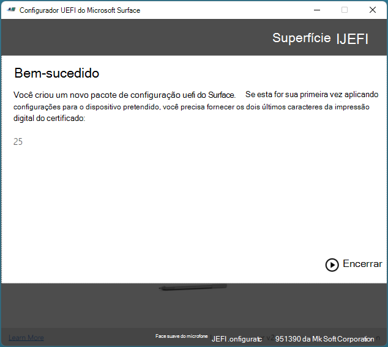

# <a name="microsoft-surface-enterprise-management-mode-semm"></a>Microsoft Surface Enterprise Management Mode (SEMM)

O SEMM (Microsoft Surface Enterprise Management Mode) é um recurso de dispositivos Surface com UEFI (Interface de Firmware Extensível Unificado) do Surface. Você pode usar o SEMM para:

- Proteja e gerencie as configurações de firmware em sua organização.
- Prepare as configurações de UEFI e instale-as em um dispositivo Surface.

O SEMM também usa um certificado para proteger a configuração contra violação ou remoção não autorizada. Para migrar um Surface Hub 2S para Windows 10 Pro ou Windows Enterprise, o SEMM é necessário.

## <a name="supported-devices"></a>Dispositivos com suporte

O SEMM só está disponível em dispositivos com firmware UEFI do Surface, incluindo: 

- Surface Pro 8 (somente SKUs comerciais)
- Surface Pro 4 e posterior (todos os SKUs)
- Surface Pro X (todos os SKUs)
- Surface Laptop ES (todos os SKUs)
- Surface Laptop Studio (somente SKUs comerciais) 
- Surface Hub 2S
- Surface Laptop 4 (somente SKUs comerciais)
- Surface Laptop 3 (somente processadores Intel)
- Surface Laptop Go 
- Surface Book (todas as gerações)
- Surface Go, Surface Go 2
- Surface Go 3 (somente SKUs comerciais)
- Surface Studio 

>[!TIP]
> Os SKUs comerciais (também conhecidos como Surface for Business) executam Windows 10 Pro/Enterprise ou SKUs de consumidor do Windows 11 Pro/Enterprise; executam Windows 10/Windows 11 Home. Para saber mais, confira [Exibir as informações do sistema](https://support.microsoft.com/windows/view-your-system-info-a965a8f2-0773-1d65-472a-1e747c9ebe00). 


## <a name="getting-started"></a>Começando 

Quando os dispositivos Surface são configurados pelo SEMM e protegidos com o certificado SEMM, eles são considerados *registrados* no SEMM. Quando o certificado SEMM é removido e o controle das configurações uefi é retornado ao usuário do dispositivo, o dispositivo Surface é considerado não *registrado no* SEMM.

Há duas opções administrativas que você pode usar para gerenciar o SEMM e registrar dispositivos Surface:

- A ferramenta autônoma SEMM, Microsoft Surface UEFI Configurator, é descrita neste artigo.

- Integração com Microsoft Endpoint Configuration Manager. Para obter informações, [consulte Use Microsoft Endpoint Configuration Manager para gerenciar dispositivos com SEMM](use-system-center-configuration-manager-to-manage-devices-with-semm.md).

## <a name="microsoft-surface-uefi-configurator"></a>Configurador UEFI do Microsoft Surface

O workspace principal do SEMM é o Microsoft Surface UEFI Configurator, conforme mostrado na Figura 1.

Você pode usar o Microsoft Surface UEFI Configurator para:

- Crie Windows (.msi) instalador.
- Use imagens do WinPE para registrar, configurar e cancelar o registro semm em um dispositivo Surface.

Esses pacotes contêm um arquivo de configuração que especifica as configurações de UEFI. Os pacotes SEMM também contêm um certificado que é instalado e armazenado no firmware e é usado para verificar a assinatura de arquivos de configuração antes que as configurações da UEFI sejam aplicadas.

>[!TIP]
>Agora você pode usar o Surface UEFI Configurator e o SEMM para gerenciar portas no Surface Dock 2. Para saber mais, confira [as portas do Secure Surface Dock 2 com o SEMM](secure-surface-dock-ports-semm.md).


*Figura 1. Configurador UEFI do Microsoft Surface*

Você pode usar a ferramenta Microsoft Surface UEFI Configurator em três modos:

- [Pacote de configuração UEFI do Surface](#configuration-package). Use esse modo para criar um pacote de configuração UEFI do Surface para registrar um dispositivo Surface no SEMM e definir as configurações de UEFI em dispositivos registrados.
- [Pacote de redefinição UEFI do Surface](#reset-package). Use esse modo para cancelar o registro de um dispositivo Surface do SEMM.
- [Solicitação de recuperação UEFI do Surface](#recovery-request). Use esse modo para responder a uma solicitação de recuperação para cancelar o registro de um dispositivo Surface do SEMM em que uma operação Redefinir Pacote não seja bem-sucedida.

### <a name="download-microsoft-surface-uefi-configurator"></a>Baixar o Microsoft Surface UEFI Configurator

Você pode baixar o Microsoft Surface UEFI Configurator na página [Ferramentas do Surface para TI](https://www.microsoft.com/download/details.aspx?id=46703) no Centro de Download da Microsoft.

- Para dispositivos Intel/AMD, baixe: **SurfaceUEFI_Configurator_v2.94.139.0_x64.msi**
- Para dispositivos ARM, baixe: **SurfaceUEFI_Configurator_v2.94.139.0_x86.msi.**

### <a name="configuration-package"></a>Pacote de configuração

Os pacotes de configuração UEFI do Surface são o mecanismo principal para implementar e gerenciar o SEMM em dispositivos Surface. Esses pacotes contêm um arquivo de configuração e um arquivo de certificado, conforme mostrado na Figura 2. O arquivo de configuração contém as configurações de UEFI que são especificadas quando o pacote é criado no Microsoft Surface UEFI Configurator. Quando um pacote de configuração é executado pela primeira vez em um dispositivo Surface que ainda não está registrado no SEMM, ele provisiona o arquivo de certificado no firmware do dispositivo e registra o dispositivo no SEMM. Ao registrar um dispositivo no SEMM e antes que o certificado seja armazenado e o registro seja concluído, você será solicitado a confirmar a operação fornecendo os dois últimos dígitos da impressão digital do certificado SEMM. Essa confirmação exige que um usuário esteja fisicamente presente no dispositivo durante o registro para executar a confirmação.


*Figura 2. Proteger um pacote de configuração semm com um certificado*

Para obter mais informações sobre os requisitos para o certificado SEMM, consulte a seção de requisitos de certificado do Modo de Gerenciamento do [Surface Enterprise](#surface-enterprise-management-mode-certificate-requirements) mais adiante neste artigo.

>[!TIP]
>Você tem a opção de exigir uma senha UEFI com SEMM. Se você fizer isso, a senha será necessária para exibir as páginas **segurança****,** dispositivos **,** configuração de inicialização **e Enterprise gerenciamento** do Surface UEFI.

Depois que um dispositivo é registrado no SEMM, o arquivo de configuração é lido e as configurações especificadas no arquivo são aplicadas à UEFI. Quando você executa um pacote de configuração em um dispositivo que já está registrado no SEMM, a assinatura do arquivo de configuração é verificada em relação ao certificado armazenado no firmware do dispositivo. Se a assinatura não corresponder, nenhuma alteração será aplicada ao dispositivo.

### <a name="enable-or-disable-devices-in-surface-uefi-with-semm"></a>Habilitar ou desabilitar dispositivos na UEFI do Surface com o SEMM

A lista a seguir mostra todos os dispositivos disponíveis que você pode gerenciar no SEMM:

- Encaixe da porta USB
- Áudio integrado
- Unidade de processamento de gráficos digitais
- Capa de tipo
- Cartão Micro SD
- Câmera frontal
- Câmera traseira
- Câmera infravermelha (para Windows Hello)
- Bluetooth
- Rede sem fio e Bluetooth
- Evolução de longo prazo (LTE)

 >[!NOTE]
>Na página Dispositivos UEFI, os dispositivos internos podem variar, dependendo do seu dispositivo ou ambiente corporativo. Por exemplo, não há suporte para a página Dispositivos UEFI no Surface Pro X; O LTE só aparece em dispositivos equipados com LTE.

### <a name="configure-advanced-settings-with-semm"></a>Definir configurações avançadas com o SEMM

**Tabela 1. Configurações avançadas**

| Configuração                            | Descrição                                                                                                                                                                                        |
| ---------------------------------- | -------------------------------------------------------------------------------------------------------------------------------------------------------------------------------------------------- |
| Inicialização de IPv6 para PXE                  | Permite gerenciar o suporte a IPv6 para inicialização PXE. Se você não definir essa configuração, o suporte a IPv6 para inicialização PXE será desabilitado.                                                                               |
| Inicialização alternativa                     | Permite que você gerencie o uso de uma ordem de inicialização alternativa para inicializar diretamente em um dispositivo USB ou Ethernet pressionando o botão Reduzir Volume e o botão Ligar/Desligar durante a inicialização. Se você não definir essa configuração, a inicialização alternativa será habilitada. |
| Bloqueio da ordem de inicialização                    | Permite bloquear a ordem de inicialização para evitar alterações. Se você não definir essa configuração, o Bloqueio de Ordem de Inicialização será desabilitado.                                                                                                        |
| Inicialização USB                           | Permite gerenciar a inicialização em dispositivos USB. Se você não definir essa configuração, a Inicialização USB estará habilitada.                                                                                                                 |
| Pilha de Rede                      | Permite que você gerencie as configurações de inicialização da Pilha de Rede. Se você não definir essa configuração, a capacidade de gerenciar as configurações de inicialização da Pilha de Rede será desabilitada.                                                                                                           |
| Ligar automaticamente                      | Permite que você gerencie as configurações de inicialização de Ligar Automaticamente. Se você não definir essa configuração, a opção Ligar Automaticamente estará habilitada.                                                                                                        |
| SMT (Multi-Threading Simultâneo) | Permite que você gerencie o SMT (Multi-Threading Simultâneo) para habilitar ou desabilitar o hyperthreading. Se você não definir essa configuração, a SMT estará habilitada.                                                  |
|Habilitar limite de bateria| Permite que você gerencie a funcionalidade de limite de bateria. Se você não definir essa configuração, o limite de bateria estará habilitado |
| Segurança                           | Exibe a página Segurança uefi **do** Surface. Se você não definir essa configuração, a página Segurança será exibida.                                                                                                                 |
| Devices                            | Exibe a página Dispositivos UEFI **do** Surface. Se você não definir essa configuração, a página Dispositivos será exibida.                                                                                                                     |
| Iniciar                               | Exibe a página De inicialização UEFI **do** Surface. Se você não definir essa configuração, a página Inicialização será exibida.                                                                                                                                                            |
| DateTime                           | Exibe a página **DateTime** uefi do Surface. Se você não definir essa configuração, a página DateTime será exibida.                                                                                                                |
| EnableOSMigration                          | Permite que você migre Surface Hub 2 de Windows 10 Team para Windows 10/11 Pro ou Enterprise. Se você não definir essa configuração, Surface Hub 2 dispositivos poderão executar apenas o Windows 10 Team sistema operacional. Observação: a inicialização dupla entre Windows 10 Team e Windows 10/11 Pro/Enterprise não está disponível no Surface Hub 2.                                                                                                           |

>[!TIP]
>Quando você cria um pacote de configuração semm, dois caracteres são **** mostrados na página Êxito, conforme mostrado na Figura 3.



*Figura 3. Exibição dos dois últimos caracteres da impressão digital do certificado na página Bem-sucedida*

Esses caracteres são os dois últimos caracteres da impressão digital do certificado e devem ser gravados ou gravados. Os caracteres são necessários para confirmar o registro no SEMM em um dispositivo Surface, conforme mostrado na Figura 4.


*Figura 4. Confirmação de registro no SEMM com a impressão digital do certificado SEMM*

>[!TIP]
>Os administradores com acesso ao arquivo de certificado (.pfx) podem ler a impressão digital a qualquer momento abrindo o arquivo .pfx no CertMgr. Para exibir a impressão digital com CertMgr:
>
>1. Selecione e segure (ou clique com o botão direito do mouse) no arquivo .pfx e selecione **Abrir**.
>2. No painel de navegação, expanda a pasta.
>3. Selecione **Certificados**.
>4. No painel principal, selecione e segure (ou clique com o botão direito do mouse) no certificado e selecione **Abrir**.
>5. Selecione a **guia** Detalhes.
>6. No menu **suspenso Mostrar** , Somente **Todas ou** **Propriedades** devem ser selecionadas.
>7. Selecione o **campo Impressão** Digital.

Para registrar um dispositivo Surface no SEMM ou aplicar a configuração uefi de um pacote de configuração, execute o arquivo .msi com privilégios administrativos no dispositivo Surface pretendido. Você pode usar tecnologias de implantação de aplicativos ou de implantação de sistema operacional, [como Microsoft Endpoint Configuration Manager](/mem/configmgr) implantação ou a implantação [da Microsoft Toolkit](/mem/configmgr/mdt). Ao registrar um dispositivo no SEMM, você deve estar fisicamente presente para confirmar o registro no dispositivo. Quando você aplica uma configuração a dispositivos que já estão registrados no SEMM, a interação do usuário não é necessária.

Para obter um passo a passo de como registrar um dispositivo Surface no SEMM ou aplicar uma configuração uefi do Surface com SEMM, consulte Registrar e configurar dispositivos [Surface com SEMM](enroll-and-configure-surface-devices-with-semm.md).

### <a name="reset-package"></a>Redefinir pacote

Um pacote de redefinição UEFI do Surface é usado para executar apenas uma tarefa – para cancelar o registro de um dispositivo Surface do SEMM. O pacote de redefinição contém instruções assinadas para remover o certificado SEMM do firmware do dispositivo e redefinir as configurações de UEFI para as configurações padrão de fábrica. Como um pacote de configuração UEFI do Surface, um pacote de redefinição deve ser assinado com o mesmo certificado SEMM provisionado no dispositivo Surface. Quando você cria um pacote de redefinição semm, é necessário fornecer o número de série do dispositivo Surface que você pretende redefinir. Os pacotes de redefinição do SEMM não são universais — eles são específicos de um dispositivo.

### <a name="recovery-request"></a>Solicitação de recuperação

Em alguns cenários, pode ser impossível usar um pacote de redefinição uefi do Surface. (Por exemplo, se Windows se tornar inutilizável no dispositivo Surface.) Nesses cenários, você pode cancelar o registro do dispositivo Surface do SEMM por meio **** da página gerenciamento de Enterprise do Surface UEFI (mostrada na Figura 5) com uma operação de Solicitação de Recuperação.

> [!div class="mx-imgBorder"]
> 

*Figura 5. Iniciar uma solicitação de recuperação do SEMM na página Enterprise Gerenciamento*

Quando você usa o processo na página **gerenciamento Enterprise** para redefinir o SEMM em um dispositivo Surface, você recebe uma Solicitação de Redefinição. Essa Solicitação de Redefinição pode ser salva como um arquivo em uma unidade USB, copiada como texto ou lida como um código QR com um dispositivo móvel para ser enviada por email ou mensagem facilmente. Use a opção Solicitação de Redefinição do Configurador UEFI do Microsoft Surface para carregar um arquivo de Solicitação de Redefinição ou para inserir o texto de Solicitação de Redefinição ou Código QR. O Microsoft Surface UEFI Configurator gera um código de verificação que pode ser inserido no dispositivo Surface. Se você inserir o código no dispositivo Surface e selecionar **Reiniciar**, o dispositivo será cancelado do SEMM.

>[!NOTE]
>Uma Solicitação de Redefinição expira duas horas após sua criação.

Para obter um passo a passo de como cancelar o registro de dispositivos Surface do SEMM, consulte [Cancelar o registro de dispositivos Surface do SEMM](unenroll-surface-devices-from-semm.md).

## <a name="surface-enterprise-management-mode-certificate-requirements"></a>Requisitos de certificado do Modo de Gerenciamento do Surface Enterprise

Quando você usa o SEMM com o Microsoft Surface UEFI Configurator e deseja aplicar as configurações de UEFI, um certificado é necessário para verificar a assinatura de arquivos de configuração. Esse certificado garante que, depois que um dispositivo for registrado no SEMM, somente os pacotes criados com o certificado aprovado poderão ser usados para modificar as configurações de UEFI.

>[!NOTE]
>Para fazer qualquer modificação nas configurações de UEFI semm ou Surface em dispositivos Surface registrados, o certificado SEMM é necessário. Se o certificado SEMM estiver corrompido ou perdido, o SEMM não poderá ser removido ou redefinido. Gerencie seu certificado SEMM adequadamente com uma solução apropriada para backup e recuperação

Os pacotes criados com a ferramenta Microsoft Surface UEFI Configurator são assinados com um certificado. Esse certificado garante que, depois que um dispositivo for registrado no SEMM, somente os pacotes criados com o certificado aprovado poderão ser usados para modificar as configurações da UEFI.

### <a name="recommended-certificate-settings"></a>Configurações de certificado recomendadas

As seguintes configurações são recomendadas para o certificado SEMM:

- **Algoritmo de chave** – RSA
- **Comprimento da** chave – 2048
- **Algoritmo de hash** – SHA-256
- **Tipo** – Autenticação do Servidor SSL
- **Uso de** Chave – Assinatura digital, Codificação de Chave
- **Provedor** – Provedor de criptografia AES e RSA aprimorado da Microsoft
- **Data de validade** – 15 meses após a criação do certificado
- **Política de Exportação de Chave** – Exportável

Também é recomendável que o certificado SEMM seja autenticado em uma arquitetura de PKI (infraestrutura de chave pública) de duas camadas em que a AC (autoridade de certificação) intermediária é dedicada ao SEMM, permitindo a revogação de certificados. Para obter mais informações sobre uma configuração de PKI de duas camadas, consulte Test [Lab Guide: Deploying an AD CS Two-Tier PKI Hierarchy](/previous-versions/windows/it-pro/windows-server-2012-R2-and-2012/hh831348(v=ws.11)).

### <a name="self-signed-certificate"></a>Certificado autoassinado

Você pode usar o script do PowerShell de exemplo a seguir para criar um certificado autoassinado para uso em cenários de prova de conceito.
Para usar esse script, copie o texto a seguir para Bloco de notas e salve o arquivo como um script do PowerShell (.ps1).

> [!NOTE]
> Esse script cria um certificado com uma senha de `12345678`. O certificado gerado por esse script não é recomendado para ambientes de produção.
  
```powershell
if (-not (Test-Path "Demo Certificate"))  { New-Item -ItemType Directory -Force -Path "Demo Certificate" }
if (Test-Path "Demo Certificate\TempOwner.pfx") { Remove-Item "Demo Certificate\TempOwner.pfx" }

# Generate the Ownership private signing key with password 12345678
$pw = ConvertTo-SecureString "12345678" -AsPlainText -Force

$TestUefiV2 = New-SelfSignedCertificate `
  -Subject "CN=Surface Demo Kit, O=Contoso Corporation, C=US" `
  -Type SSLServerAuthentication `
  -HashAlgorithm sha256 `
  -KeyAlgorithm RSA `
  -KeyLength 2048 `
  -KeyUsage KeyEncipherment `
  -KeyUsageProperty All `
  -Provider "Microsoft Enhanced RSA and AES Cryptographic Provider" `
  -NotAfter (Get-Date).AddYears(25) `
  -TextExtension @("2.5.29.37={text}1.2.840.113549.1.1.1") `
  -KeyExportPolicy Exportable

$TestUefiV2 | Export-PfxCertificate -Password $pw -FilePath "Demo Certificate\TempOwner.pfx"
```

>[!IMPORTANT]
>Para uso com o SEMM e o Microsoft Surface UEFI Configurator, o certificado deve ser exportado com a chave privada e com proteção por senha. O Microsoft Surface UEFI Configurator solicita que você selecione o arquivo de certificado SEMM (.pfx) e a senha do certificado.

Para criar um certificado autoassinado:

1. Na unidade C:, crie a pasta em que você salvará o script; por exemplo, C:\SEMM.
2. Copie o script de exemplo Bloco de notas (ou editor de texto equivalente) e salve o arquivo como um script do PowerShell (.ps1).
3. Entre no computador com credenciais de administrador e abra uma sessão do PowerShell com privilégios elevados.
4. Verifique se suas permissões estão definidas para permitir que os scripts sejam executados. Por padrão, os scripts são impedidos de ser executados, a menos que você modifique a política de execução. Para saber mais, confira [Sobre políticas de execução](/powershell/module/microsoft.powershell.core/about/about_execution_policies).
5. No prompt de comando, insira o caminho completo do script e pressione **Enter**. O script cria um Certificado de Demonstração chamado TempOwner.pfx.

Como alternativa, você pode criar seu próprio certificado autoassinado usando o PowerShell. Para obter mais informações, [consulte New-SelfSignedCertificate](/powershell/module/pkiclient/new-selfsignedcertificate).

>[!NOTE]
>Para organizações que usam uma raiz offline em sua infraestrutura de PKI, o Microsoft Surface UEFI Configurator deve ser executado em um ambiente conectado à AC raiz para autenticar o certificado SEMM. Os pacotes gerados pelo Microsoft Surface UEFI Configurator podem ser transferidos como arquivos, para que possam ser transferidos para fora do ambiente de rede offline com armazenamento removível, como um pen drive.

### <a name="managing-certificates-faq"></a>Perguntas frequentes sobre o gerenciamento de certificados

O comprimento *mínimo* recomendado é de 15 meses. Você pode usar um certificado que expira em menos de 15 meses ou usar um certificado que expire em mais de 15 meses.

>[!NOTE]
>Quando um certificado expira, ele não é renovado automaticamente.

**Um certificado expirado afetará a funcionalidade dos dispositivos registrados no SEMM?**<br><br>
Não, um certificado afeta apenas as tarefas de gerenciamento de administradores de TI no SEMM e não tem efeito sobre a funcionalidade do dispositivo quando ele expira.

**O pacote e o certificado SEMM precisarão ser atualizados em todos os computadores que o têm?**<br><br>
Se você quiser que a redefinição ou a recuperação do SEMM funcionem, o certificado precisa ser válido e não expirou.

**Os pacotes de redefinição em massa podem ser criados para cada superfície que solicitamos? Pode-se criar um que redefina todos os computadores em nosso ambiente?**<br><br>
Os exemplos do PowerShell que criam um pacote de configuração para um tipo de dispositivo específico também podem ser usados para criar um pacote de redefinição independente de número de série. Se o certificado ainda for válido, você poderá criar um pacote de redefinição usando o PowerShell para redefinir o SEMM.

## <a name="version-history"></a>Histórico de versão

### <a name="version-2941390"></a>Versão 2.94.139.0

Esta versão do SEMM inclui:

- Suporte para Surface Laptop Studio, Surface Pro 8 e Surface Go 3

### <a name="version-2831390"></a>Versão 2.83.139.0

Esta versão do SEMM inclui:

- Suporte para Surface Laptop 4
- Suporte para opção de multithreading simultânea para Surface Pro 7
- Remoção de configurações de SEMM obsoletas  
- Assinatura de MSI aprimorada

### <a name="version-2791390"></a>Versão 2.79.139.0

Esta versão do SEMM inclui:

- Suporte para Surface Pro 7+.
- Melhorias na experiência do usuário.

### <a name="version-2781390"></a>Versão 2.78.139.0

Esta versão do SEMM inclui:

- Suporte para Surface Laptop Go e Surface Pro X.
- Notificações para novas versões de versão.
- A capacidade de criar pacotes personalizados para alterar a propriedade.
- Correções.

### <a name="version-2731360"></a>Versão 2.73.136.0

Esta versão do SEMM inclui:

- A capacidade de o áudio ser desabilitado no Surface Hub2S usando SEMM.
- Suporte para Surface Pro X para Dock 2.
- Suporte para o UeFI Manager para operações relacionadas ao Dock 2.
- Uma correção de bug do pacote de redefinição do Surface Go.
- Suporte para migrar Surface Hub 2 dispositivos Windows 10 Team sistema operacional para Windows 10 Pro ou Enterprise.

### <a name="version-2711390"></a>Versão 2.71.139.0

Esta versão do SEMM adiciona suporte para recursos de gerenciamento do Surface Dock 2 para Surface Book 3, Surface Laptop 3 e Surface Pro 7. Ele inclui:

- A capacidade de habilitar áudio (bloqueio/desbloqueio) e portas Ethernet e USB.
- A capacidade de criar pacotes de encaixe para hosts autenticados e não autenticados.

### <a name="version-2701300"></a>Versão 2.70.130.0

Esta versão do SEMM inclui:

- Suporte para o Surface Go 2.
- Suporte para Surface Book 3.
- Correções.

### <a name="version-2591390"></a>Versão 2.59.139.0

Esta versão do SEMM inclui:

- Suporte para Surface Pro 7, Surface Pro X e Surface Laptop 3 modelos de 13,5" e 15" com processador Intel.
    >[!NOTE]
    >Surface Laptop processador AMD de 3 15" não tem suporte.
- Suporte para o recurso Ativar Energia.

### <a name="version-2541390"></a>Versão 2.54.139.0

Esta versão do SEMM inclui:

- Suporte para Surface Hub 2S.
- Correções.

### <a name="version-2431360"></a>Versão 2.43.136.0

Esta versão do SEMM inclui:

- Suporte para habilitar/desabilitar multithreading simultâneo.
- Opções separadas para rede sem fio e Bluetooth para alguns dispositivos.
- Limite de bateria removido para Surface Studio.

### <a name="version-2261360"></a>Versão 2.26.136.0

Esta versão do SEMM inclui:

- Suporte para Surface Studio 2.
- Recurso de limite de bateria.

### <a name="version-2211360"></a>Versão 2.21.136.0

Esta versão do SEMM inclui:

- Suporte para Surface Pro 6.
- Suporte para Surface Laptop 2.

### <a name="version-2141360"></a>Versão 2.14.136.0

Esta versão do SEMM inclui:

- Suporte para Surface Go.

### <a name="version-291360"></a>Versão2.9.136.0

Esta versão do SEMM inclui:

- Suporte para Surface Book 2.
- Suporte para Surface Pro LTE.
- Melhorias de acessibilidade.

### <a name="version-10740"></a>Versão 1.0.74.0

Esta versão do SEMM inclui:

- Suporte para Surface Laptop.
- Suporte para Surface Pro.
- Correções de bugs e melhorias gerais.

## <a name="related-topics"></a>Tópicos relacionados

- [Registrar e configurar dispositivos Surface com o SEMM](enroll-and-configure-surface-devices-with-semm.md)
- [Cancelar o registro de dispositivos Surface no SEMM](unenroll-surface-devices-from-semm.md)
- [Portas do Secure Surface Dock 2 com SEMM](secure-surface-dock-ports-semm.md)
